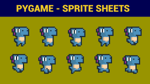
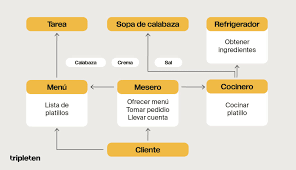
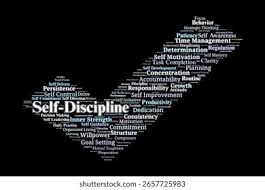
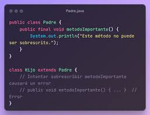
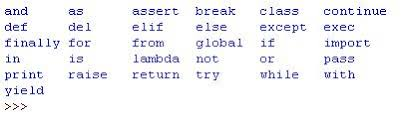
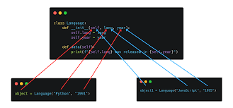
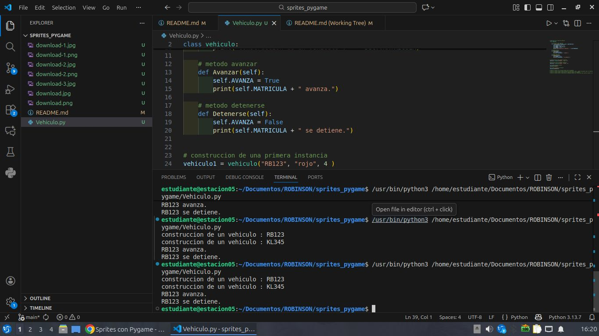
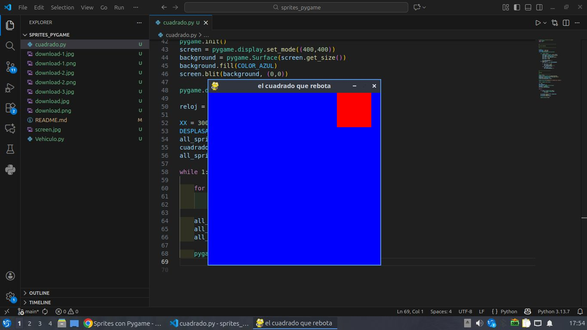

# sprites_pygame

## Sprites con Pygame

### Que es ?

- La noción de sprite es fundamental en el desarrollo de videojuegos y, en particular, en el
desarrollo de Pygame. Cuando abordamos el desarrollo de un videojuego, nos damos cuenta
de que sistemáticamente encontramos el siguiente patrón recurrente: asociar una ubicación de
la ventana con una representación gráfica y un conjunto de propiedades. Esto es cierto
siempre: para elementos del escenario, las paredes de un laberinto, los personajes, el héroe o
la heroína, los enemigos y, en general, para cualquier elemento gráfico del juego. Obviamente
esto es cierto para los objetos que se manipulan durante el escenario del juego. Por ejemplo,
armas, objetos utilizados por los personajes o el balón de un juego deportivo.

### La noción de grupo en Pygame

- Por un lado, la manipulación de sprites permite no "reinventar la rueda" con cada programa
nuevo, sino ser más eficiente en el desarrollo gracias a otra noción: la de grupo. Un grupo es
una colección de sprites.

## Algunas explicaciones sobre la programación orientada a objetos

### 1. El paradigma del objeto, las líneas principales

- La primera idea de la programación orienta a objetos es manipular objetos que representan un
concepto de la realidad o no. Por ejemplo, podemos intentar representar un vehículo y
considerar que está compuesto por una matrícula, un color de carrocería y un número de
puertas (tres o cinco puertas).

### Palabras clave fundamentales en Python

### La palabra clave self

- Hay una palabra clave fundamental en Python cuando se manipula el paradigma de objeto. Se
trata de la palabra clave self.
Esta palabra clave es el equivalente de this en C++ o C#. Representa la instancia actual. Por
lo tanto, en una porción dada del código, podemos especificar que accedemos a un atributo de
la instancia actual o que llamamos a un método de la instancia actual.

### La palabra clave class

- La palabra clave class es, como era de esperar, la palabra clave que define una clase en
Python.

### La palabra clave def

- La palabra clave def se utiliza para definir una función nueva. También permite definir un
método nuevo dentro de una clase.

### __init__

- __init__ en realidad no es una palabra clave, pero no importa. Se corresponde con la
nomenclatura (obligatoria) del inicializador de la clase. Lo que es necesario recordar es que
hace posible crear e inicializar una instancia de clase.

## Ejemplo de la clase Vehiculo:

## En este punto tenemos esta definición de la clase CUADRADO:
